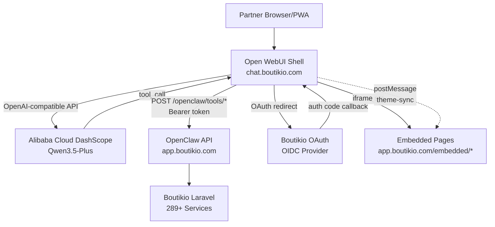

# Design: OpenClaw Open WebUI Integration

## Overview

This design covers the customization of an Open WebUI fork (v0.8.10) to serve as Boutikio's partner-facing AI chat interface. The fork connects to Qwen3.5-Plus via Alibaba Cloud DashScope, authenticates partners via Boutikio OAuth (OIDC), registers OpenClaw as an OpenAPI tool server, and adds 6 embedded iframe pages accessible from a customized sidebar.

The design philosophy is "additive, not rewrite" — we add new SvelteKit routes, modify one existing component (Sidebar.svelte), and swap static branding assets. This keeps upstream rebasing simple.

### Key Design Decisions

1. **iframe over native Svelte plugins** — Embedded pages use iframes pointing to Boutikio's Laravel-rendered views. This ships faster and reuses existing Blade templates. Migration to native Svelte plugins is a future optimization.
2. **postMessage for theme sync** — Cross-origin iframe communication uses `window.postMessage` with a `theme-sync` protocol. The parent observes `MutationObserver` on `<html>` class changes to detect dark/light toggles.
3. **Shared EmbeddedPage component** — All 6 iframe routes use a single reusable Svelte component to avoid duplication.
4. **OAuth token exchange** — Open WebUI's built-in `ENABLE_OAUTH_TOKEN_EXCHANGE` passes the partner's Boutikio access token to OpenClaw on every tool call, eliminating separate auth.
5. **Environment-driven configuration** — All external URLs, API keys, and feature flags are configured via Docker environment variables, not hardcoded.
6. **`/partner-settings` route** — We use `/partner-settings` instead of `/settings` to avoid conflicting with Open WebUI's existing settings route.

## References

- #[[file:docs/ai-agent/openclaw-openwebui.md]]
- #[[file:docs/ai-agent/openclaw.md]]
- #[[file:docs/ai-agent/openclaw-laravel.md]]
- #[[file:docs/ai-agent/openclaw-mcp-architecture.md]]
- #[[file:.kiro/specs/openclaw-openwebui-integration/requirements.md]]

## Architecture



### Subdomain Layout

| Domain | Service | Role |
|--------|---------|------|
| `chat.boutikio.com` | Open WebUI fork (this repo) | Partner chat UI, sidebar, embedded page routes |
| `app.boutikio.com` | Boutikio Laravel | OAuth provider, OpenClaw API, embedded page content |

Both sit behind the same reverse proxy with a wildcard SSL cert for `*.boutikio.com`.

---

## Components and Interfaces

### 1. OAuth Integration (Configuration-only)

Open WebUI's built-in OAuth support handles the entire OIDC flow. No code changes needed — only environment configuration.

**Environment Variables:**
```yaml
ENABLE_OAUTH_SIGNUP: true
ENABLE_LOGIN_FORM: false
OAUTH_MERGE_ACCOUNTS_BY_EMAIL: true
ENABLE_OAUTH_TOKEN_EXCHANGE: true
OAUTH_PROVIDERS: |
  {
    "boutikio": {
      "client_id": "open-webui",
      "client_secret": "${BOUTIKIO_OAUTH_SECRET}",
      "server_url": "https://app.boutikio.com",
      "scope": "openid profile email partner",
      "redirect_uri": "https://chat.boutikio.com/oauth/callback",
      "provider_name": "Boutikio",
      "icon_url": "/static/boutikio-logo.svg"
    }
  }
```

**Flow:**
1. Partner visits `chat.boutikio.com` → sees "Login with Boutikio" button
2. Redirect to `app.boutikio.com/oauth/authorize`
3. Partner authenticates with existing Boutikio credentials
4. Callback to `chat.boutikio.com/oauth/callback` with authorization code
5. Open WebUI exchanges code for access token + ID token
6. Local user created/updated from ID token claims (`sub`, `name`, `email`)
7. Access token stored for tool server calls

**Satisfies:** Requirement 3

### 2. LLM Connection (Configuration-only)

DashScope connection via OpenAI-compatible API. Configured in environment and admin panel.

```yaml
OPENAI_API_BASE_URL: https://dashscope-intl.aliyuncs.com/compatible-mode/v1
OPENAI_API_KEY: ${DASHSCOPE_API_KEY}
DEFAULT_MODELS: qwen3.5-plus
```

NemoClaw system prompt configured in admin panel under Models → qwen3.5-plus.

**Satisfies:** Requirements 2, 8

### 3. OpenClaw Tool Server (Configuration-only)

Registered in Open WebUI admin panel as an OpenAPI tool server:
- URL: `https://app.boutikio.com/openclaw/openapi.json`
- Auth type: `system_oauth` (passes partner's Boutikio token)

Open WebUI auto-discovers tools from the OpenAPI spec and injects them into the LLM's function calling context.

**Satisfies:** Requirement 4

### 4. EmbeddedPage Component (New — Svelte)

A reusable Svelte component that renders an iframe with theme synchronization.

**File:** `src/lib/components/embedded/EmbeddedPage.svelte`

**Props Interface:**
```typescript
interface EmbeddedPageProps {
  src: string;        // Full URL of the embedded page
  title: string;      // Accessible iframe title
  allow?: string;     // iframe allow attribute (e.g., "payment")
}
```

**Behavior:**
- On mount, sets up a `MutationObserver` on `document.documentElement` to watch for `class` attribute changes (dark/light toggle)
- Listens for `embedded-ready` postMessage from the iframe
- Sends `theme-sync` postMessage with current CSS variables
- On dark/light toggle, re-sends theme-sync to the iframe
- On unmount, disconnects the observer and removes event listeners
- Renders iframe at full width/height with no border

**Theme Sync Protocol:**

Parent → iframe:
```json
{
  "type": "theme-sync",
  "vars": {
    "--owui-bg": "#ffffff",
    "--owui-text": "#1a1a1a",
    "--owui-accent": "#3b82f6",
    "--owui-border": "#e5e7eb",
    "--mode": "light"
  }
}
```

iframe → Parent:
```json
{ "type": "embedded-ready" }
```

**CSS Variable Extraction:**
The component reads current theme values from `getComputedStyle(document.documentElement)`:
- `--color-gray-50` → `--owui-bg`
- `--color-gray-900` → `--owui-text`
- `--color-blue-500` → `--owui-accent`
- `--color-gray-200` → `--owui-border`
- `document.documentElement.classList.contains('dark')` → `--mode`

**Satisfies:** Requirement 6 (AC 2-7)

### 5. Embedded Page Routes (New — 6 SvelteKit routes)

Each route is a thin wrapper around the `EmbeddedPage` component.

| Route File | iframe src | Title | allow |
|------------|-----------|-------|-------|
| `src/routes/(app)/billing/+page.svelte` | `https://app.boutikio.com/embedded/billing` | Billing & Subscription | `payment` |
| `src/routes/(app)/partner-settings/+page.svelte` | `https://app.boutikio.com/embedded/settings` | Account Settings | — |
| `src/routes/(app)/receipt-settings/+page.svelte` | `https://app.boutikio.com/embedded/receipt-settings` | Receipt Settings | — |
| `src/routes/(app)/card-preview/+page.svelte` | `https://app.boutikio.com/embedded/card-preview` | Card Preview | — |
| `src/routes/(app)/audit-log/+page.svelte` | `https://app.boutikio.com/embedded/audit-log` | Audit Log | — |
| `src/routes/(app)/members/+page.svelte` | `https://app.boutikio.com/embedded/members` | Members | — |

Each route file imports `EmbeddedPage` and passes the appropriate props. Example:

```svelte
<script>
  import EmbeddedPage from '$lib/components/embedded/EmbeddedPage.svelte';
</script>

<EmbeddedPage
  src="https://app.boutikio.com/embedded/billing"
  title="Billing & Subscription"
  allow="payment"
/>
```

**Satisfies:** Requirement 6 (AC 1)

### 6. Sidebar Modification (Modified — Sidebar.svelte)

Add a "Boutikio" navigation section to `src/lib/components/layout/Sidebar.svelte` below the existing chat list items.

**Navigation items:**

```typescript
const boutikioNavItems = [
  { icon: '💳', label: 'Billing', href: '/billing' },
  { icon: '⚙️', label: 'Settings', href: '/partner-settings' },
  { icon: '🧾', label: 'Receipt Settings', href: '/receipt-settings' },
  { icon: '🎴', label: 'Card Preview', href: '/card-preview' },
  { icon: '📋', label: 'Audit Log', href: '/audit-log' },
  { icon: '👥', label: 'Members', href: '/members' },
];
```

Each item renders as an `<a>` tag with:
- Icon (emoji) + label text
- `href` pointing to the SvelteKit route
- Active state styling when `$page.url.pathname` matches the `href`
- `on:click` handler that calls `itemClickHandler()` for mobile sidebar close

The navigation section is placed after the existing sidebar items (Notes, Workspace) and before the user profile section. It uses a visual separator (thin border line) to distinguish from chat history.

**Satisfies:** Requirement 5

### 7. Branding Assets (New — Static files)

| File | Purpose |
|------|---------|
| `static/boutikio-logo.svg` | Sidebar header logo, OAuth button icon |
| `static/boutikio-favicon.ico` | Browser tab favicon |
| `static/boutikio-pwa-icon-192.png` | PWA icon 192×192 |
| `static/boutikio-pwa-icon-512.png` | PWA icon 512×512 |

**PWA Manifest** (`static/manifest.json`):
```json
{
  "name": "Boutikio",
  "short_name": "Boutikio",
  "description": "Manage your loyalty program with AI",
  "start_url": "/",
  "display": "standalone",
  "background_color": "#ffffff",
  "theme_color": "#3b82f6",
  "icons": [
    { "src": "/static/boutikio-pwa-icon-192.png", "sizes": "192x192", "type": "image/png" },
    { "src": "/static/boutikio-pwa-icon-512.png", "sizes": "512x512", "type": "image/png" }
  ]
}
```

**UI Hiding:** The model selector dropdown is hidden for non-admin users via a conditional check on the user's role. This is a small modification in the chat header component.

**Satisfies:** Requirement 7

### 8. Docker Configuration (New)

`docker-compose.yml` at repo root with all environment variables:

```yaml
services:
  open-webui:
    build: .
    ports:
      - "3000:8080"
    volumes:
      - open-webui-data:/app/backend/data
    environment:
      - WEBUI_URL=https://chat.boutikio.com
      - WEBUI_NAME=Boutikio
      - WEBUI_SECRET_KEY=${WEBUI_SECRET_KEY}
      - ENABLE_OAUTH_SIGNUP=true
      - ENABLE_LOGIN_FORM=false
      - OAUTH_MERGE_ACCOUNTS_BY_EMAIL=true
      - ENABLE_OAUTH_TOKEN_EXCHANGE=true
      - OAUTH_PROVIDERS=${OAUTH_PROVIDERS_JSON}
      - OPENAI_API_BASE_URL=https://dashscope-intl.aliyuncs.com/compatible-mode/v1
      - OPENAI_API_KEY=${DASHSCOPE_API_KEY}
      - DEFAULT_MODELS=qwen3.5-plus
      - SHOW_ADMIN_DETAILS=false
      - ENABLE_COMMUNITY_SHARING=false
      - ENABLE_MESSAGE_RATING=false
    restart: unless-stopped

volumes:
  open-webui-data:
```

**Satisfies:** Requirements 1, 2, 3, 7

---

## Data Models

No new database models are introduced in the Open WebUI fork. All data lives in:

- **Open WebUI's existing SQLite/PostgreSQL** — User accounts (created via OAuth), chat history, settings
- **Boutikio's MySQL** — Partner data, members, vouchers, audit logs (accessed via OpenClaw API and embedded pages)

### Theme Sync Data (Runtime — postMessage)

```typescript
interface ThemeSyncMessage {
  type: 'theme-sync';
  vars: {
    '--owui-bg': string;
    '--owui-text': string;
    '--owui-accent': string;
    '--owui-border': string;
    '--mode': 'dark' | 'light';
  };
}

interface EmbeddedReadyMessage {
  type: 'embedded-ready';
}
```

### Sidebar Navigation Config (Compile-time)

```typescript
interface SidebarNavItem {
  icon: string;      // Emoji
  label: string;     // Display text
  href: string;      // SvelteKit route path
}
```

### Environment Variables Summary

| Variable | Type | Description |
|----------|------|-------------|
| `BOUTIKIO_OAUTH_SECRET` | string | OAuth client secret for Boutikio provider |
| `DASHSCOPE_API_KEY` | string | Alibaba Cloud DashScope API key |
| `WEBUI_SECRET_KEY` | string | Open WebUI session encryption key |
| `WEBUI_URL` | string | Public URL (`https://chat.boutikio.com`) |
| `WEBUI_NAME` | string | Display name (`Boutikio`) |

---

## Correctness Properties

### Property 1: Navigation-to-iframe mapping consistency

*For any* Boutikio sidebar navigation item in the configuration, the sidebar link's `href` should correspond to a SvelteKit route that renders an iframe whose `src` attribute points to the correct Boutikio embedded page URL (`https://app.boutikio.com/embedded/{page-slug}`).

**Validates:** Requirements 5, 6

### Property 2: Theme sync message completeness

*For any* theme sync trigger event (either an `embedded-ready` postMessage from an iframe, or a dark/light mode toggle on the document element), the `theme-sync` message sent to the iframe must contain all required CSS variable keys (`--owui-bg`, `--owui-text`, `--owui-accent`, `--owui-border`) and a valid `--mode` value (`"dark"` or `"light"`).

**Validates:** Requirement 6 (AC 5, 6)

---

## Error Handling

### iframe Loading Failures
If an embedded page fails to load (network error, 4xx/5xx from Boutikio), the EmbeddedPage component shows a fallback message: "Could not load page. Try refreshing or open it directly." with a link to the Boutikio URL.

### OAuth Failures
Handled by Open WebUI's built-in OAuth error handling — displays an error message on the login page. No custom code needed.

### DashScope API Failures
Handled by Open WebUI's existing chat error handling — displays the error in the chat interface. No custom code needed.

### Theme Sync Failures
If postMessage fails (iframe not loaded, cross-origin blocked), the embedded page falls back to its default light theme CSS variables. The `embedded-ready` handshake ensures theme sync only fires after the iframe is ready.

### Tool Call Failures
If OpenClaw returns an error (validation failure, subscription gate block), Open WebUI passes the error response back to Qwen3.5-Plus, which formats it as a natural language message for the partner.

---

## Testing Strategy

### Unit Tests (vitest)

- Sidebar renders all 6 Boutikio navigation items with correct labels and hrefs
- EmbeddedPage component renders an iframe with the provided `src`, `title`, and `allow` props
- PWA manifest contains "Boutikio" branding values
- Each embedded page route file exists and imports EmbeddedPage with correct props

### Property-Based Tests (vitest + fast-check)

**Property Test 1: Navigation-to-iframe mapping**
- Tag: `Feature: openclaw-openwebui-integration, Property 1`
- Generate random subsets of the navigation config
- For each item, verify the href maps to a valid route path and the corresponding iframe src follows the pattern `https://app.boutikio.com/embedded/{slug}`
- Verify no two nav items share the same href or the same iframe src
- Minimum 100 iterations

**Property Test 2: Theme sync message completeness**
- Tag: `Feature: openclaw-openwebui-integration, Property 2`
- Generate random CSS variable values (valid CSS color strings) and random mode values
- Call the theme sync builder function
- Verify the output message always contains all 5 required keys
- Verify `--mode` is always either `"dark"` or `"light"`
- Minimum 100 iterations

### Integration Tests (Manual)

1. OAuth flow: Login with Boutikio → redirect → authenticated
2. Tool call: Chat message → Qwen3.5-Plus → OpenClaw → response
3. Theme sync: Toggle dark mode → embedded page updates
4. Full journey: Login → chat → sidebar nav → embedded page → back to chat

---

## File Inventory

### New Files

| File | Type | Purpose |
|------|------|---------|
| `src/lib/components/embedded/EmbeddedPage.svelte` | Svelte component | Reusable iframe wrapper with theme sync |
| `src/routes/(app)/billing/+page.svelte` | SvelteKit route | Billing embedded page |
| `src/routes/(app)/partner-settings/+page.svelte` | SvelteKit route | Settings embedded page |
| `src/routes/(app)/receipt-settings/+page.svelte` | SvelteKit route | Receipt settings embedded page |
| `src/routes/(app)/card-preview/+page.svelte` | SvelteKit route | Card preview embedded page |
| `src/routes/(app)/audit-log/+page.svelte` | SvelteKit route | Audit log embedded page |
| `src/routes/(app)/members/+page.svelte` | SvelteKit route | Members embedded page |
| `static/boutikio-logo.svg` | Static asset | Sidebar logo |
| `static/boutikio-favicon.ico` | Static asset | Browser favicon |
| `static/boutikio-pwa-icon-192.png` | Static asset | PWA icon 192×192 |
| `static/boutikio-pwa-icon-512.png` | Static asset | PWA icon 512×512 |
| `docker-compose.yml` | Docker config | Container orchestration |
| `.env.boutikio` | Environment | Boutikio-specific env vars template |

### Modified Files

| File | Change |
|------|--------|
| `src/lib/components/layout/Sidebar.svelte` | Add Boutikio navigation section with 6 items |
| `static/manifest.json` | Update PWA branding to Boutikio |
